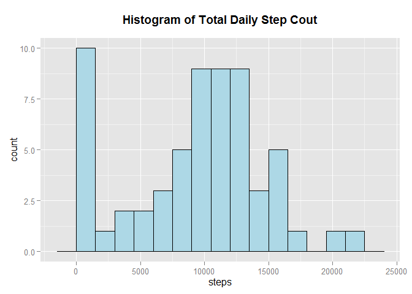
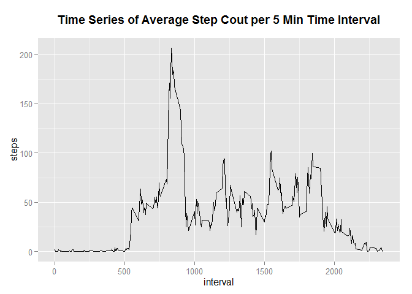
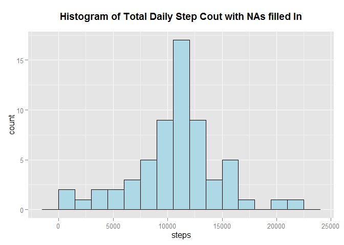
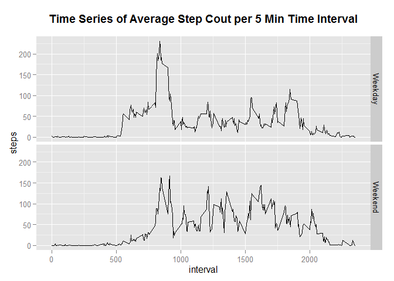

# Reproducible Research: Peer Assessment 1
This report covers assignment 1 for the Reproducible Research class offered by Coursera.

## Introduction

It is now possible to collect a large amount of data about personal
movement using activity monitoring devices such as a
[Fitbit](http://www.fitbit.com), [Nike
Fuelband](http://www.nike.com/us/en_us/c/nikeplus-fuelband), or
[Jawbone Up](https://jawbone.com/up). These type of devices are part of
the "quantified self" movement -- a group of enthusiasts who take
measurements about themselves regularly to improve their health, to
find patterns in their behavior, or because they are tech geeks. But
these data remain under-utilized both because the raw data are hard to
obtain and there is a lack of statistical methods and software for
processing and interpreting the data.

This assignment makes use of data from a personal activity monitoring
device. This device collects data at 5 minute intervals through out the
day. The data consists of two months of data from an anonymous
individual collected during the months of October and November, 2012
and include the number of steps taken in 5 minute intervals each day.

## Data

The data for this assignment can be downloaded from the course web
site:

* Dataset: [Activity monitoring data](https://d396qusza40orc.cloudfront.net/repdata%2Fdata%2Factivity.zip) [52K]

The variables included in this dataset are:

* **steps**: Number of steps taking in a 5-minute interval (missing
    values are coded as `NA`)

* **date**: The date on which the measurement was taken in YYYY-MM-DD
    format

* **interval**: Identifier for the 5-minute interval in which
    measurement was taken


The dataset is stored in a comma-separated-value (CSV) file and there
are a total of 17,568 observations in this
dataset.


## Assignment Report
This report will cover five sections required by the assignement:

1. Loading and preprocessing the data

2. What is the mean total number of steps taken per day?

3. What is the average daily activity pattern?

4. Imputing missing values

5. Are there differences in activity patterns between weekdays and weekends?

Each section will be covered below including code needed to answer the question.

### Loading and preprocessing the data
First a set of libraries are loaded so that the rest of the code will run correctly.


```r
library(dplyr)
library(lubridate)
library(data.table)
library(ggplot2)
```
1. **Load the data**

To load the data, it is assume the ZIP file listed above is in the current working dirrectory.  If the unziped file is not present, then the source file will be unzipped. The `csv` file in then read into memeory.


```r
# unzip file if it does not exist
if (!file.exists("activity.csv")){
    unzip("activity.zip")
}
# load csv file and 
activity <- suppressWarnings(fread("activity.csv", sep=",", header=TRUE, na.strings="NA"))
```

2. **Process/transform the data**

In this case the only transformation thta is needed is to convert the `date` field from text to POSIXct.

```r
# convert test date to POSIX data formate
activity$date <- ymd(activity$date)
```


### What is the mean total number of steps taken per day?
To answer this question, the data needs to be summarized by the total step count per day.  The results are then presented below as a histogram. 

1. **Calculate the total number of steps taken per day**

Summerizing the data by day was done using function from the `dply` package.


```r
# summarize sum of step count by dayactivity_fill <- activity %>%
step_by_days <- activity %>% group_by(date) %>% summarize(steps=sum(steps, na.rm = TRUE))
```
2. **Make a histogram of the total number of steps taken each day**

```r
# plot total daily step count
m <- ggplot(step_by_days, aes(x=steps)) 
m <- m + geom_histogram(colour = "black",fill = "lightblue", binwidth=1500)
m <- m + ggtitle("Histogram of Total Daily Step Cout\n")
m + theme(plot.title = element_text(lineheight=.8, face="bold"))
```

 

3. **Calculate and report the mean and median of the total number of steps taken per day**

Results for the total number of steps taken per day are:

The `mean` = 9354 Steps per day.

The `median` = 10395 steps per day.

### What is the average daily activity pattern?
To look at the activity pattern over time, the 5 min time interval data was graphed as a time series of the average interval step count. To do this, the data was grouped by `interval` and summarized by the `mean` of the step count per `interval`. The resulting pattern shows clearly a night time with almost no activity, early morning buisiness and then random steady activity throughout the rest of the day. 

1. **Make a time series plot of the 5-minute interval** 


```r
# summerze average step count per time interval across all days
step_by_interval <- activity %>% group_by(interval) %>% summarize(steps=mean(steps, na.rm = TRUE))

# plot time series of ave step count by interval
p <- ggplot(step_by_interval, aes(x=interval, y=steps)) + geom_line()
p <- p + ggtitle("Time Series of Average Step Cout per 5 Min Time Interval\n")
p + theme(plot.title = element_text(lineheight=.8, face="bold"))
```

 

2. **Which 5-minute interval contains the maximum number of steps**

The maximum numbers of steps happens at interval 835.


### Imputing missing values
This part of the assignment is requireing us to fill in the `NA` values and then compare results to the previous section.


1. **Calculate and report the total number of missing values in the dataset** 


```r
NA_rows <- nrow(activity) - sum(complete.cases(activity))
```
The number of missing values is `NA_rows`.

2. **Devise a strategy for filling in all of the missing values in the dataset**

Looking at the data, it appears that the `NA` values appear for entire days only.  Therefore, I decided to fill in the missing values with interval averages calculated across the rest of the days. I felt this was better that using that days average since it would have been 0.  An improvment would have been to find the interval average by *weekend* vs. *weekday* and then fill in the missing day intervals that way. 

Here are the `count` of missing values per `date` as supporting evidence, each day has all intervals missing:

```r
# Find days with NA and count the number of missing values
ind <- which(is.na(activity$steps), arr.ind=TRUE)
missing <- activity[ind,]

missing %>% group_by(date) %>% summarize(count=n())
```

```
## Source: local data table [8 x 2]
## 
##         date count
## 1 2012-10-01   288
## 2 2012-10-08   288
## 3 2012-11-01   288
## 4 2012-11-04   288
## 5 2012-11-09   288
## 6 2012-11-10   288
## 7 2012-11-14   288
## 8 2012-11-30   288
```
*Note: there are only 288 intervals per each day even for days with data*

3. **Create a new dataset that is equal to the original dataset but with the missing data filled in**


```r
# fill NA with average for that interval
activity_fill <- activity %>%
    group_by(interval) %>% 
    mutate_each(funs(replace(., which(is.na(.)), as.integer(mean(., na.rm=TRUE)))),steps)
```

4. **Make a histogram of the total number of steps taken each day and Calculate and report the mean and median total number of steps taken per day**


```r
# summarize sum of step count by dayactivity_fill <- activity %>%
step_by_days_fill <- activity_fill %>% group_by(date) %>% summarize(steps=sum(steps, na.rm = TRUE))

# plot total daily step count
m <- ggplot(step_by_days_fill, aes(x=steps)) + geom_histogram(colour = "black",fill = "lightblue", binwidth=1500)
m <- m + ggtitle("Histogram of Total Daily Step Cout with NAs filled In\n")
m + theme(plot.title = element_text(lineheight=.8, face="bold"))
```

 

Results for the total number of steps taken per day are now:

The `mean` = 10749 Steps per day.

The `median` = 10641 steps per day.

5. **Do these values differ from the estimates from the first part of the assignment? What is the impact of imputing missing data on the estimates of the total daily number of steps**


Filling in the `NA` values with the average per interval step count has a significan impact on the results. Since these missing values are from days with now logging, the biggest impact is that the *zero* step count days have been removed / filled in. The impact is that the `mean` and `median` have increased. I think in this case I would have prefered to just remove these days.

### Are there differences in activity patterns between weekdays and weekends?

1. **Create a new factor variable in the dataset with two levels – “weekday” and “weekend” indicating whether a given date is a weekday or weekend day**


```r
activity_fill <- activity_fill %>% mutate(week_part=ifelse(weekdays(date) %in% c('Saturday','Sunday'),"Weekend","Weekday"))
```

2. **Make a panel plot containing a time series plot of the 5-minute interval by *weekday* and *weekend***


```r
# summarize the data by interval and week_part
step_by_interval_wd <- activity_fill %>% group_by(week_part,interval) %>% summarize(steps=mean(steps))

# plot time series of ave step count by interval and weekend/weekday
p <- ggplot(step_by_interval_wd, aes(x=interval, y=steps)) + geom_line()
p <- p + ggtitle("Time Series of Average Step Cout per 5 Min Time Interval\n")
p + theme(plot.title = element_text(lineheight=.8, face="bold")) + facet_grid(week_part ~ .)
```

 
